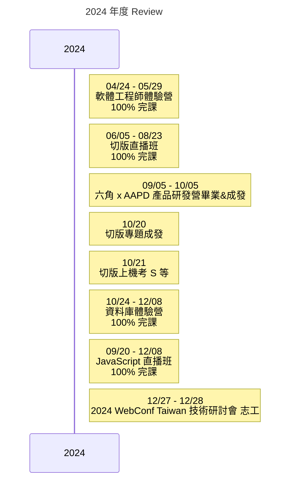

> 回頭一看發現 2024 年做了超級多的事情，從一個前端超白到現在前端微白，還不到可以獨立做事的程度但也是都是略懂略懂了。這是前一年完全不會想到的自己...

<!-- truncate -->

## 2024 完成了什麼？
:::tip
今年你完成了什麼？是完成了一個功能、學會了一項技術，還是有哪些具體成果或里程碑？
:::
* [軟體工程師體驗營](https://zenn.dev/articles/65c6d508b32b1f/) 100% 作業繳交完課
* [切版直播班](https://zenn.dev/chloetseng/articles/2024-layout-course-dailymission) 100% 作業繳交完課
* 六角 x AAPD 產品研發營 -  與 AAPD 設計師協作成發
* 切版專題 - 切版專題成發
* [切版上機考](https://zenn.dev/chloetseng/articles/fe884fb860290b) S 等
* [資料庫體驗營](https://zenn.dev/chloetseng/articles/2024-sql-experience-camp) 100% 作業繳交完課
* [JavaScript 直播班](https://zenn.dev/chloetseng/articles/2024-js-dailymission) 100% 作業繳交完課
* [2024 WebConf 志工](https://zenn.dev/chloetseng/articles/2024-webconf-volunteer)

 
:::tip
這些成果對你來說有什麼意義？跟去年寫下的現狀相比，這些成果如何幫助你接近長遠目標?
:::
之前其實沒有列下什麼長遠目標，在今年思考職涯的時候有想過想要找有符合以下的職位，各種了解與接觸後決定往前端工程師進修。
* 可以微遠端辦公
* 想要學一技之長
* 技術是可以帶著走並延續到下一份工作的
* 想要薪資有所成長
* 學習新技術的痛並快樂

## 下一步…
:::tip
你的下一步計劃是什麼？你會如何運用這次經驗來改進未來的行動？下一步的具體目標是什麼？
:::
* 要學的還很多前端的水很深呀www 但主要明年度要開始準備找工作，希望可以 5 月上岸
* 要準備開始衝專題了
* 也要開始準備面試題
* 以及自己的作品集
* 樂樂教練說可以去職涯博覽會了解 JD 與各公司的團隊配制來安排自己後續的履歷撰寫以及投遞的方向。
* 小瑜說保持平常心，投個百來封或被打槍是正常的。

##  最後に
回頭一看發現 2024 年做了超級多的事情，從一個前端超白到現在前端微白，還不到可以獨立做事的程度但也是都是略懂略懂了。

這是前一年完全不會想到的自己，雖然我永遠相信只要願意學、有心做沒有什麼事是學不會的；但年初時無數次的覺得自己不行想要放棄的念頭也是滿滿的。

很高興能在這個時候遇到六角，比起學到技術更多的其實是心靈上與態度上的成長，

> 『你不需要一開始很厲害，但要開始了才會變厲害』

> 『跟自己比較，只要你今天進步一小步，都是比過去的自己進步，不要讓焦慮佔滿自己的思維』

…還有更多更多老師們不經意間說出，但穩穩的戳入我的心帶給我莫大的支持的話語。

*言靈的力量*

更讓我感動的是今年好多好多人敲我說有職缺問我有沒有興趣，從來沒有在經營什麼人脈之下卻有好多的人脈不停的支持我。
(雖然都不是前端缺，不過我也沒跟別人說我在學前端www)

但是願意推薦我工作表示我這個人的工作品質在他們的心中還是及格的❤

每一年都不停的不停的感受到大家的多方照顧，2025 年也請大家多指教了。