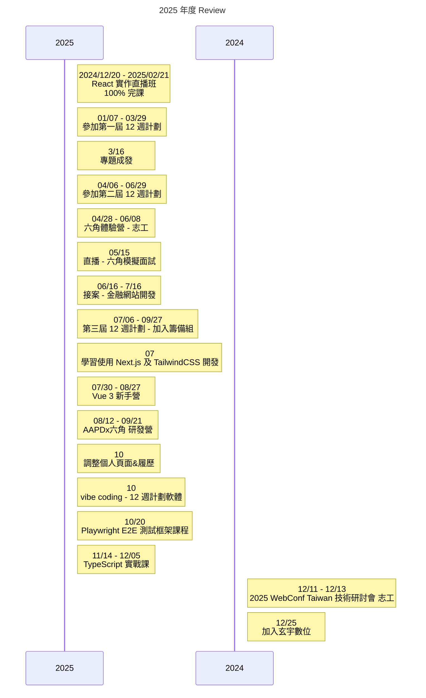

> 2025 年結束了 9 個月的培訓

<!-- truncate -->

## 2025 完成了什麼？
:::tip
今年你完成了什麼？是完成了一個功能、學會了一項技術，還是有哪些具體成果或里程碑？
:::
- `開發`：因為六角校長的推薦，接了一個金融網站開發案
- 學習了 Vue3
- 學習了 TailwindCSS
- `開發`：六角 x AAPD 產品研發營
- 學習了 TypeScript
- 學習了 Playwright E2E 測試
- `開發`：vibe coding 12 週計畫專案管理系統
- 健康：飲控瘦了 10 kg

 
:::tip
這些成果對你來說有什麼意義？跟去年寫下的現狀相比，這些成果如何幫助你接近長遠目標?
:::
- 找不到工作就會很焦慮，然後就會一直覺得自己會的不夠多，所以什麼課都想報都想學
- 跟 AAPD 的研發營真的很好玩，明年應該還會再報ww 切版很有趣，把設計師的想法想辦法實現出來也很有趣
- vibe coding 了一個 12 週計劃的專案管理系統，因為這個而壓底線在 2025 年結束前找到了工作

## 下一步…
:::tip
你的下一步計劃是什麼？你會如何運用這次經驗來改進未來的行動？下一步的具體目標是什麼？
:::
- 2026 年想要加強 Vue 以及切版的技術，還有整理結構與元件的拆分
- 新鳥生存計劃
- 因為 ai 年，也需要學習如何搭配工具加速開發與個人能力
- 健康身體：瘦到標準體重
- [繼續參加 12 週計劃](https://clove-garden.gitbook.io/shift-12/master-target)

