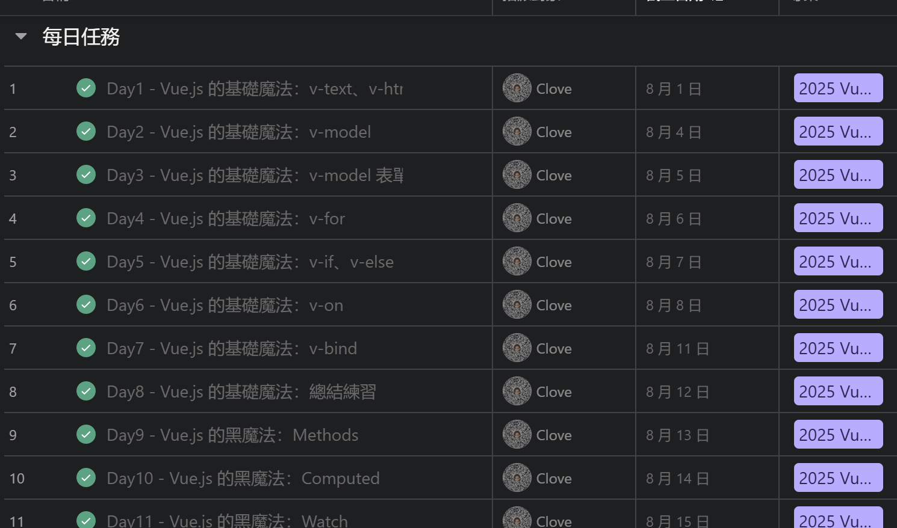
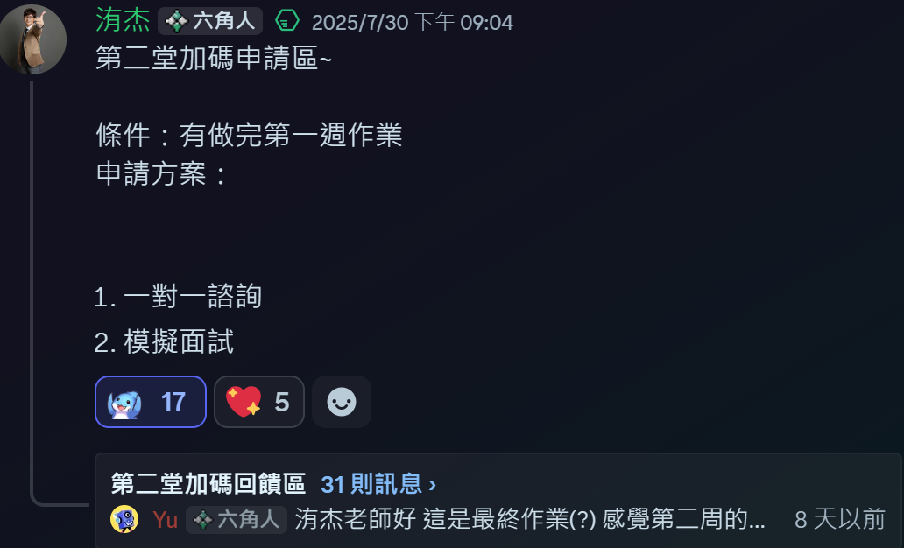

> 六角的新手營 (體驗營) 真的都是又便宜又香

我都會說六角的課程是師父領進門，修行在個人
他們會教學最核心的幾個知識點，但實際上會用到的、或是其他延伸知識你就要靠自己去想辦法獲得，從而得到自學的能力。

<!-- truncate -->

## 為什麼報名
這是為期一個月的 Vue3 新手營，我看著 104 上面 JD 寫主要技術： `vue` 的公司其實都會有點怕怕的不敢投遞，\
雖然別人都說會一種框架另一種就會學的很快，
> 但因為無知，所以會不安。
因為如此，就打著邊找邊繼續學習的想法，抖下去了。

而且這麼快樂的價格就可以學習到最核心的技能，為什麼不報呢!?

---

## 五週的學習過程，最大的收獲是？
雖然才短短的五週，我不敢說已經 **會 Vue** 了，但因此多了一些面試的機會，怎麼這麼開心呀XD\
而且確實如學長姐們所說：會一種框架另一種真的上手比較快\
並且也複習了一些相同的基礎慨念 (JS)\
也強化了傳值的慨念，寫到後面整個有點愛上寫 `Vue`，那個規範感讓 `J` 人我感到整個舒服
```js
<script setup>
  import { ref, provide, reactive } from 'vue';
  const cartData = ref([]);
  ...
</script>
<template>
  <main>
    ...
  </main>
</template>
<style scoped>
  .body {
    ...
  }
  .btn {
    ...
  }
</style>
```
*Vue 的 SFC 模版*

---

## 最喜歡新手營的哪些活動？
必須要是[每日任務](https://clovetseng.dev/docs/vue-daily/v-text)的吧!


看著自己一步一步的成長，一次只要一點點累積成一個強大的自己！\
回頭看也會為自己感到驕傲

這次還有校長加碼的『你寫作業，就問到飽』活動
\
也聽了很多在職、待轉職各方各面大家的煩惱，其中也會找到一些跟自己相關的議題可以反思，這個是在外面或是其他影音課沒辦法獲得的

---

## 對課程的建議或鼓勵？
### 強化課程內容的一致性
本次課程的核心是教學 `Composition API`，那麼所有的輔助教材，包括講義、文件、以及每日作業模板，都應該全面更新為 `Composition API` 的寫法
- 避免混淆：對於新接觸 `Vue` 的同學來說，同時接觸兩種不同的 `API` 寫法，容易造成概念上的混淆，增加學習的難度
- 即學即用：讓學員在學習新技術的同時，能立即在作業中練習，強化記憶與應用能力，達到更好的學習效果
- 提升課程品質：年度更新教材與每日作業的模版，更可以感受到課程專業度

---

## 給想入坑的新同學一些勉勵的話

抖下去吧同學們!! 明年還會看到學姐的~
