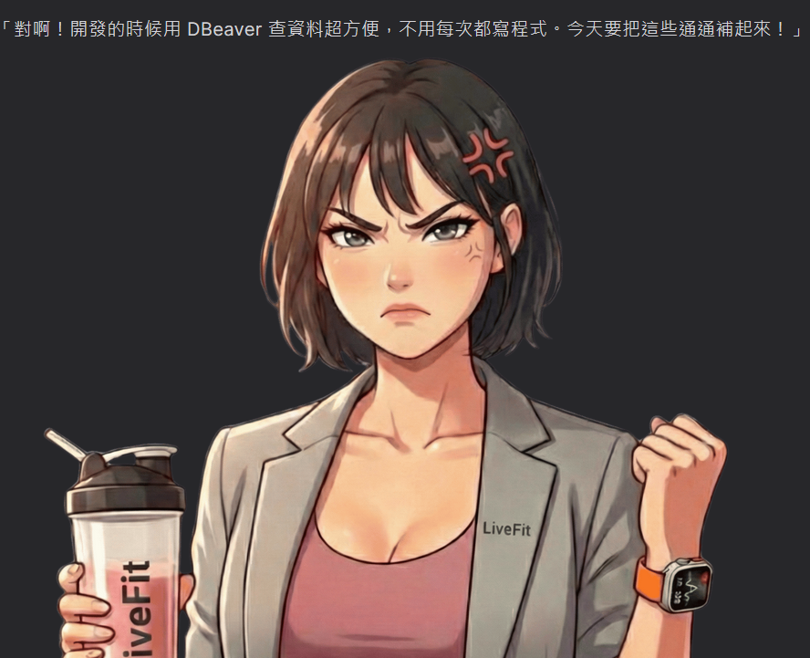
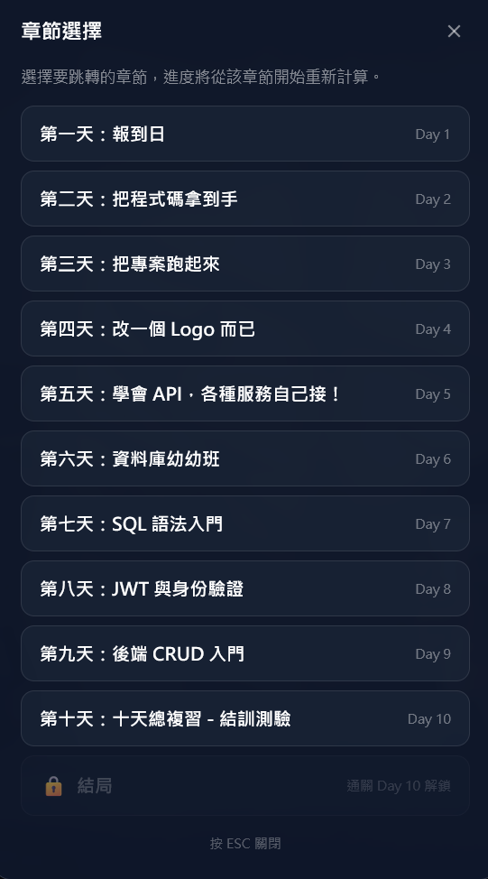
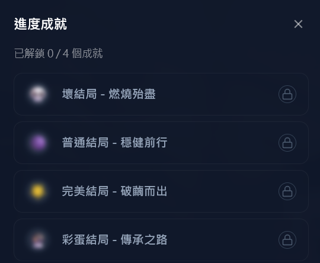

> 六角體驗營 不只便宜不只香，還跟上 AI 的潮流

六角的課程是師父領進門，修行在個人
他們會教學最核心的幾個知識點，但實際上會用到的、或是其他延伸知識你就要靠自己去想辦法獲得，從而得到自學的能力

<!-- truncate -->

## 為什麼報名
體驗營哪次不報，幾百元就算了，寫作業抽書是一定要的，你把作業寫完還會送神秘小禮物，
只要你努力，會看得見回報!!!

這次校長還直接 vibe 了一個每日任務小遊戲，讓你從第一天入職來體驗什麼是後端工程師
\
裡面還包含了互動式簡報，邊玩邊學習，覺得比以往的每日還要更容易理解

---

## 三週的學習過程，最大的收獲是？
因為我也是剛好差不多時間到職，所以每天海姐交辦的任務對話彷彿都是把現實世界濃縮進遊戲一樣，
一開始因為海姐的提醒，我又回頭請 ai 幫我整理公司專案的文件；

因為也是 docker 包前後端的專案，從六角專案中學公司的架構；
也是卡 bug 給主管添了麻煩，一樣在下班的路上不停的自責，要是我…就好了…；

所以比起完美結局，我更喜歡普通結局，字裡行間救贖了我的完美主義，
> 我只是還在努力學著告訴自己，我已經很棒了！

這不是我第一次參加的體驗營，但卻是影響我最深的一次體驗營！

我要告訴 2024 年報名切版體驗營的自己，你好棒!!
你拿出了勇氣踏出了這個改變自己的第一步，沒有你就沒有現在的我。

我也想感謝我盯的這些學長、姐同學們，沒有你們，可能我早就放棄了
感謝你們 2025 年的諸多照顧，2026 年也要麻煩你們了

---

## 本次加碼
1. 每次直播課後的職涯問答時間：這個問答真的很貼心，你的問題也可能會是別人的問題，能夠有一個地方可以免費的諮詢職涯或是學習上的問題，聽到半夜也情願，就是辛苦校長的肝了
2. 每日任務遊戲流程開發大公開：因為遊戲太精美了，還有多結局可以二刷、三刷，超多同學敲碗想聽怎麼 vibe 開發的，校長就說只要作業繳交超過 2500 份，就加碼直播課分享心路歷程以及 github repo 

更不用說幾百本的書說送就送說抽就抽，這個價格的課程費，你們真的要確，不可以倒哎!!!

---

## 給想入坑的新同學一些勉勵的話

抖下去吧同學們!! 明年還會看到學姐的~