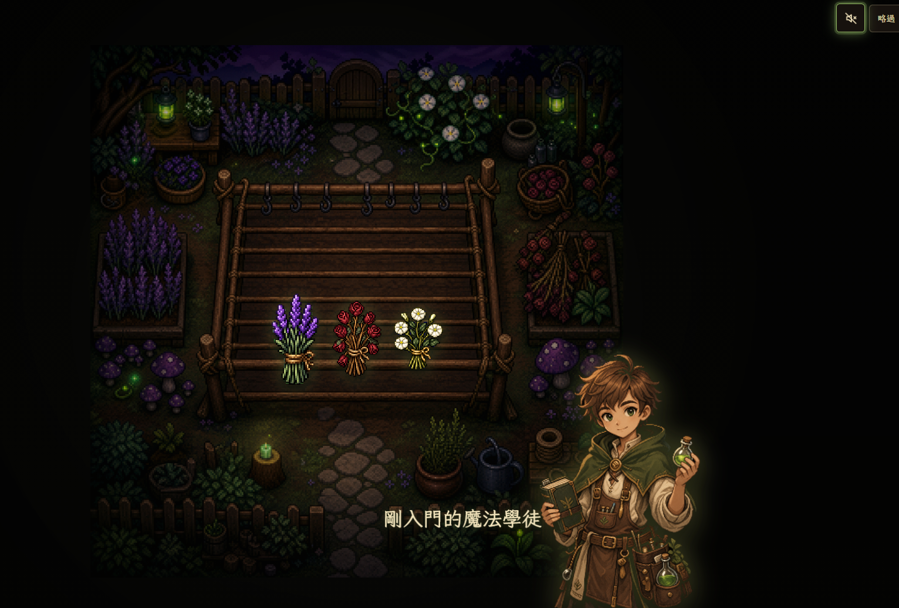
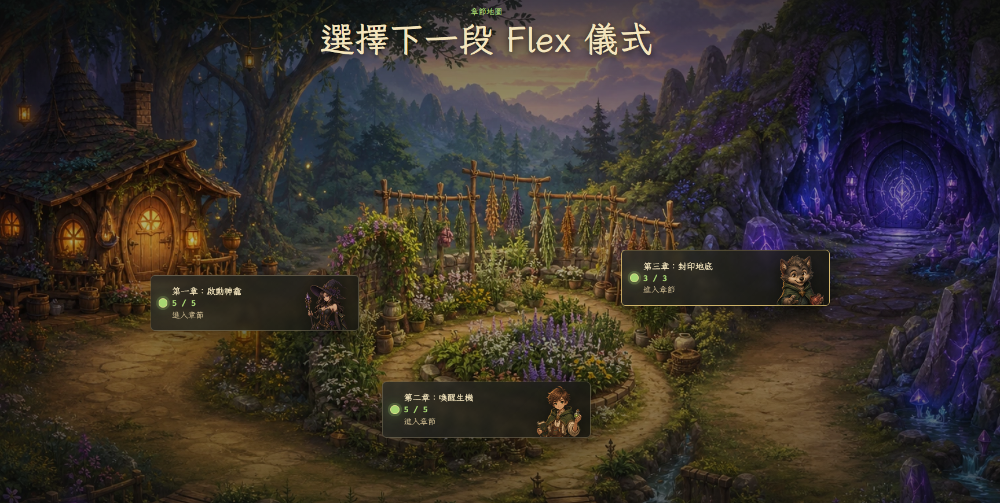
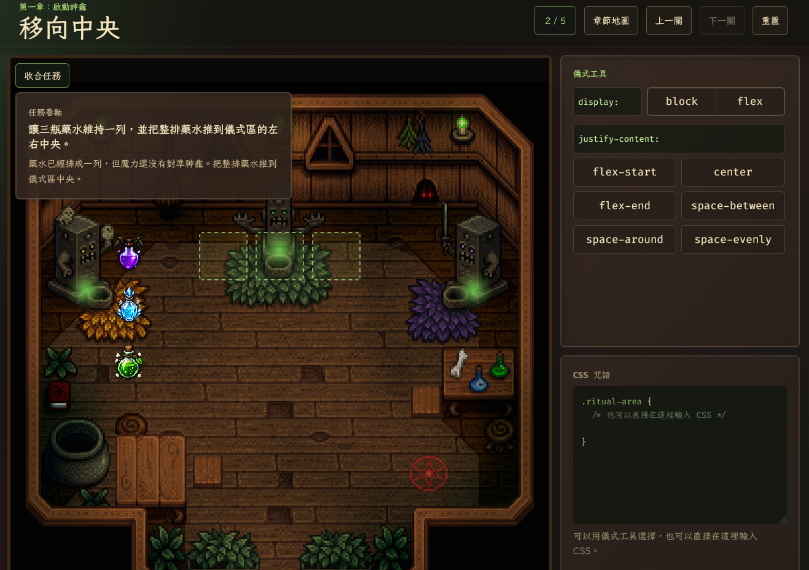

> AI 時代了，還要學習寫 code 嗎?

2026 年了，人人都能 vibe coding，讓 AI 幫你刻一個網頁好像也沒什麼大不了， 
但換個圖要重新詠唱一遍、換個按鈕顏色也要重新詠唱一遍， 
不知道 AI 在幹嘛、不知道他改了什麼、不知道有沒有被賣掉，每次改東西都像在賭博。

<!-- truncate -->

## 為什麼報名？
雖然已經踏入了前端的坑，但有時候上班會上到很迷惘並且找不到初心，這時候聽聽校長的熱血講課以及他最近在玩些什麼，莫名的會受到鼓舞， 
又回到了當時剛開始學 HTML、CSS 的時候那份心情，讓我靜下心來重新檢視自己的技能樹以及後續職涯發展。 
並且校長也會聊聊今年他對於前、後端職場現況的想法， 
當然還有每年都一定要參加的線下同學會，每次都可以認識新的同學，互相碰撞新的想法。

---

## 三週的學習過程，最大的收獲是？
受到之前 [後端體驗營](https://clovetseng.dev/blog/2026/2026-backend-camp) 校長開發每日任務 - 海姐的啟發， 
這次校長加碼鼓勵大家用 Vibe coding 做自己的 Flex 學習小遊戲，我一聽就蠢蠢欲動。

於是我做了一個 -『排版魔女工坊』🧙‍♀️：你是一位魔法學徒，透過調整『 咒語 』(屬性值) 來讓版面的 Flex 魔法成功

- 玩起來 👉 https://flex-atelier.vercel.app/
- 開發心得 👉 敬請期待

(進場動畫)

(章節地圖)

(關卡畫面)

---

## 本次加碼
- 每年老樣子的寫作業就抽書抽到爆
- 今年特別的加碼是只要你投稿 Flex 小遊戲~~前三名有 $500 元獎金~~， 因為投稿太熱絡並且各有優缺點校長實在很難評出前三名，所以只要有投稿人人有獎

看看這個投稿人數，我速滑都滑不完

---

## 給想入坑的新同學一些勉勵的話

抖下去吧同學們！！

三週真的沒有你想的那麼久，但學到的東西你可能一輩子都用得到 (特別是 Git 的部份)  
就算你之後是用 AI 幫你寫 code，你也需要一點基礎來跟它對話、審稿、抓 bug，總不能讓 AI 把你賣了還幫他數鈔票吧。

所以同學們，明年見~