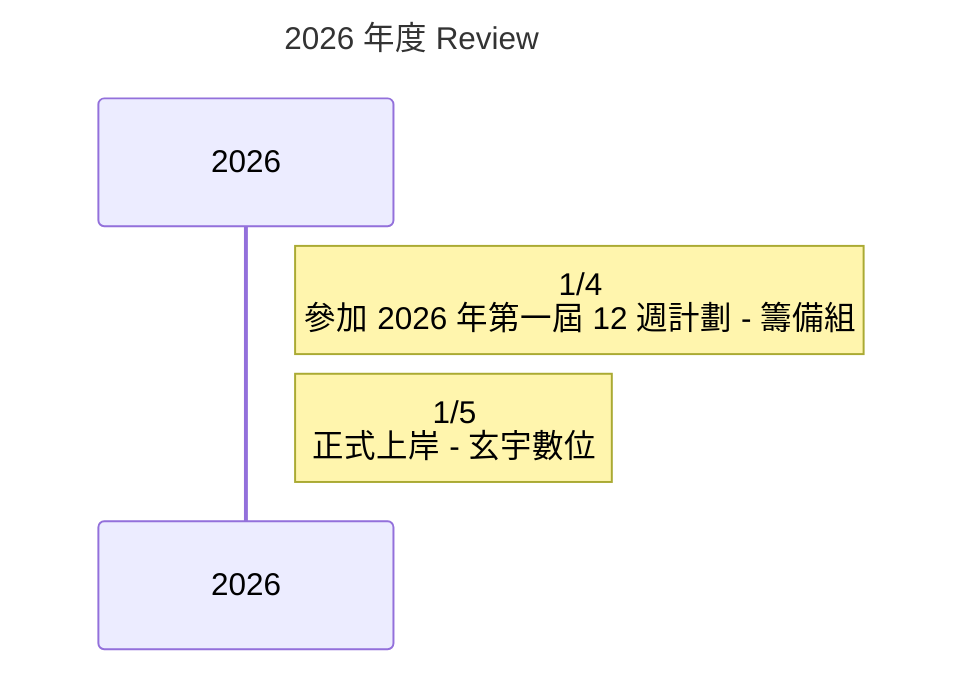

> 2026 年成為前端工程師

<!-- truncate -->

## 2026 完成了什麼？
:::tip
今年你完成了什麼？是完成了一個功能、學會了一項技術，還是有哪些具體成果或里程碑？
:::

 
:::tip
這些成果對你來說有什麼意義？跟去年寫下的現狀相比，這些成果如何幫助你接近長遠目標?
:::

## 下一步…
:::tip
你的下一步計劃是什麼？你會如何運用這次經驗來改進未來的行動？下一步的具體目標是什麼？
:::

