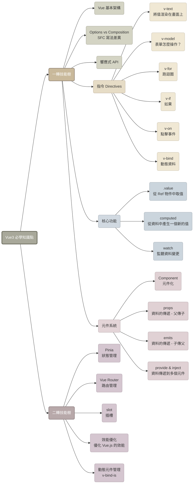

:::tip
🍢 學習 Vue3 時一定要知道的知識點\
點擊卡片可以連到該筆記
:::

```mermaid
flowchart LR
    root(Vue3 必學知識點)
    
    root --> level1(一轉技能樹)
    root --> level2(二轉技能樹)
    
    level1 --> arch(Vue 基本架構)
    level1 --> options(Options vs Composition<br/>SFC 寫法差異)
    level1 --> reactive(響應式 API)
    level1 --> directives(指令 Directives)
    level1 --> core(核心功能)
    level1 --> components(元件系統)
    
    directives --> vtext(v-text<br/>將值渲染在畫面上)
    directives --> vmodel(v-model<br/>表單怎麼操作？)
    directives --> vfor(v-for<br/>跑迴圈)
    directives --> vif(v-if<br/>如果)
    directives --> von(v-on<br/>點擊事件)
    directives --> vbind(v-bind<br/>動態資料)
    
    core --> dotvalue(.value<br/>從 Ref 物件中取值)
    core --> computed(computed<br/>從資料中產生一個新的值)
    core --> watch(watch<br/>監聽資料變更)
    
    components --> component(Component<br/>元件化)
    components --> props(props<br/>資料的傳遞 - 父傳子)
    components --> emits(emits<br/>資料的傳遞 - 子傳父)
    components --> provide(provide & inject<br/>資料傳遞到多個元件)
    
    level2 --> pinia(Pinia<br/>狀態管理)
    level2 --> router(Vue Router<br/>路由管理)
    level2 --> slot(slot<br/>插槽)
    level2 --> optimize(效能優化<br/>優化 Vue.js 的效能)
    level2 --> dynamic(動態元件管理<br/>v-bind-is)
    
    click arch "base" "Vue 基本架構"
    click options "options-composition" "Options vs Composition"
    click reactive "reactive-api" "響應式 API"
    click vtext "../vue-daily/v-text" "v-text"
    click vmodel "../vue-daily/v-model" "v-model"
    click vfor "../vue-daily/v-for" "v-for"
    click vif "../vue-daily/v-if" "v-if"
    click von "../vue-daily/v-on" "v-on"
    click vbind "../vue-daily/v-bind" "v-bind"
    click dotvalue "../vue-daily/methods" ".value"
    click computed "../vue-daily/computed" "computed"
    click watch "../vue-daily/watch" "watch"
    click component "../vue-daily/component" "Component"
    click props "../vue-daily/props" "props"
    click emits "../vue-daily/emits" "emits"
    click provide "../vue-daily/provide&inject" "provide & inject"
    click pinia "pinia" "Pinia"
    click optimize "optimize" "優化 Vue.js 的效能"
    click dynamic "v-bind-is" "動態元件管理"
    
    style root fill:#a8a89a,stroke:#6b6b5d,stroke-width:3px,color:#fff
    style level1 fill:#c9b99b,stroke:#8b7d6f,stroke-width:2px,color:#fff
    style level2 fill:#b8a9aa,stroke:#8a7b7c,stroke-width:2px,color:#fff
    style arch fill:#d4d4c4,stroke:#9a9a8a
    style options fill:#d4d4c4,stroke:#9a9a8a
    style reactive fill:#d4d4c4,stroke:#9a9a8a
    style directives fill:#e6dcc6,stroke:#b8a892
    style core fill:#d1d9e1,stroke:#9ba3ab
    style components fill:#e4d5d8,stroke:#b4a5a8
    style vtext fill:#f0e8d4,stroke:#c0b8a4
    style vmodel fill:#f0e8d4,stroke:#c0b8a4
    style vfor fill:#f0e8d4,stroke:#c0b8a4
    style vif fill:#f0e8d4,stroke:#c0b8a4
    style von fill:#f0e8d4,stroke:#c0b8a4
    style vbind fill:#f0e8d4,stroke:#c0b8a4
    style dotvalue fill:#cbd5dd,stroke:#9ba5ad
    style computed fill:#cbd5dd,stroke:#9ba5ad
    style watch fill:#cbd5dd,stroke:#9ba5ad
    style component fill:#e0d1d4,stroke:#b0a1a4
    style props fill:#e0d1d4,stroke:#b0a1a4
    style emits fill:#e0d1d4,stroke:#b0a1a4
    style provide fill:#e0d1d4,stroke:#b0a1a4
    style pinia fill:#d5c6d0,stroke:#a596a0
    style router fill:#d5c6d0,stroke:#a596a0
    style slot fill:#d5c6d0,stroke:#a596a0
    style optimize fill:#d5c6d0,stroke:#a596a0
    style dynamic fill:#d5c6d0,stroke:#a596a0
```