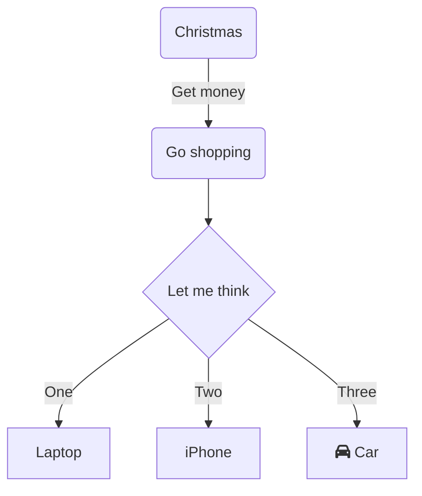

:::info
筆記參考資料為 保哥的『規格驅動開發實戰』課程\
https://learn.duotify.com/courses/sdd
:::

## 什麼是 SDD 規格驅動開發？

```mermaid
graph TB
  A(Christmas) -->|Get money| B(Go shopping)
  B --> C{Let me think}
  C -->|One| D[Laptop]
  C -->|Two| E[iPhone]
  C -->|Three| F[fa:fa-car Car] 
```

- SDD 開發流程：

### 聽起來 SDD 跟 Vibe Coding 好像，差在哪？

## 用什麼工具？
GitHub Spec Kit