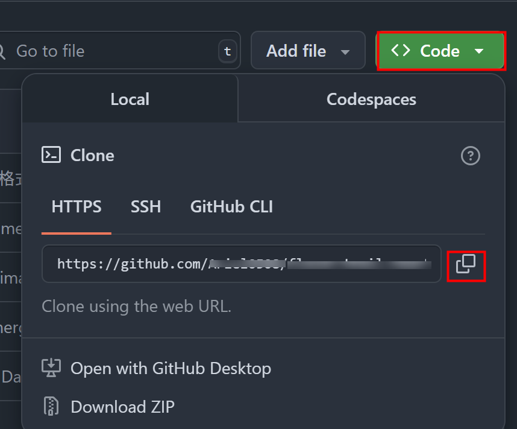

:::info
組長已經把我加入 GitHub Repo 的協作了，\
接著我在我的電腦要怎麼開始？
:::
`(已實測，有效 2024.9.11)`

## 1. 複製連結 (這裡使用 HTTPS 方式)



```bash
git clone https://github.com/xxxxxxx/xxxxxx.git  #複製這個專案

cd 專案資料夾名稱                                  # 移到這個專案資料夾內
code .                                           # 打開專案
```

## 2. 接著就可以開始開發啦，記得開發前要先開新分支唷!

```bash
git checkout -b 分支名稱
```